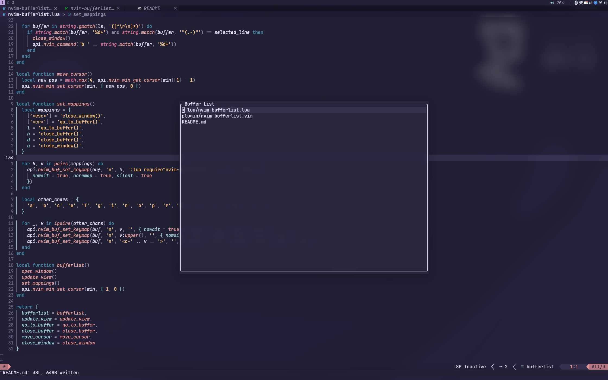

# Buffer List



My first plugin!

Improved `:ls` and quick navigation between pinned files similar to [ThePrimeagen's Harpoon plugin](https://github.com/ThePrimeagen/harpoon/tree/harpoon2).

## Updates
- Added Quick Navigation

## Features
- List open buffers
- Go to buffers
- Close buffers
- Pin files
- Quickly navigate between pinned files

## Installation
With [lazy.nvim](https://github.com/folke/lazy.nvim)
```
{ "kilavila/nvim-bufferlist" }
```

## Keymaps
Open Buffer List window with `:BufferListOpen` and Quick Navigation with `:QuickNavOpen`

Add current file to Quick Navigation list with `:QuickNavAdd`

Navigate between buffers with `:QuickNavNext` and `:QuickNavPrev` without opening the Quick Navigation window for fast navigation

or bind to a key, f.ex:
```
nnoremap <leader>bl :BufferList<CR>
nnoremap <leader>bq :QuickNavOpen<CR>
nnoremap <leader>ba :QuickNavAdd<CR>
nnoremap <C-t> :QuickNavPrev<CR>
nnoremap <C-n> :QuickNavNext<CR>
```

Keybinds to use in Buffer List window(all other keybinds are disabled)
```
Escape, q = Close window
Enter, l  = Go to buffer
h, d      = Close buffer
```

Keybinds to use in Quick Navigation window(no keybinds are disabled, and you can edit the list)
```
Escape = Close window
Enter  = Go to file
```
Want to delete a file from the list? Use `dd` like in any other buffer

## Commands
```
BufferListOpen
BufferListClose
QuickNavOpen
QuickNavAdd
QuickNavNext
QuickNavPrev
```

<a href="https://dotfyle.com/plugins/kilavila/nvim-bufferlist">
	
</a>

